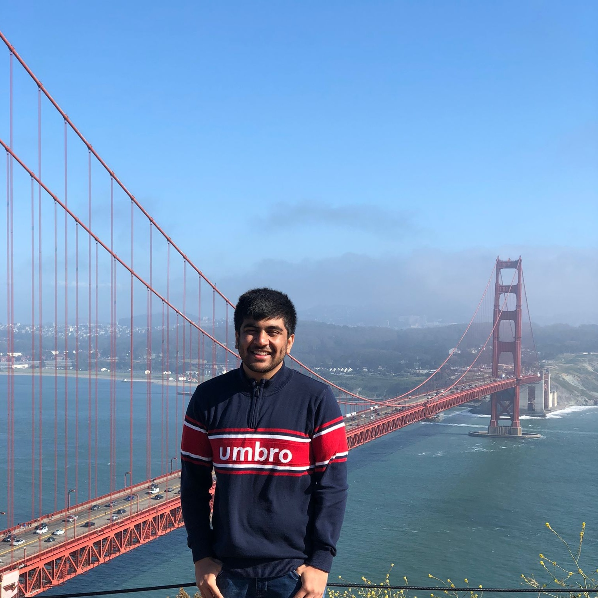

# 94889: Machine Learning for Public Policy Lab

**Previous Versions:**
- **[Spring 2020](https://github.com/dssg/mlforpublicpolicylab/tree/Spring2020)**
- **[Fall 2020](https://github.com/dssg/mlforpublicpolicylab/releases/tag/Fall2020)**
 
### Fall 2021: Tues & Thurs, 3:05-4:25pm (HBH 2008), Lab Section: Wednesday 6:20-8pm (HBH 1202)

### Important 
 - **All content will be on github in this repo including [schedule](README.md#schedule) and [tech setup instructions](techhelp/)**
 - **All assignments will be on and submitted through [canvas](https://canvas.cmu.edu/courses/25318)**
 - **Class communication and announcements will be primarily through Slack**

### Wednesday Sessions
Going forward, we'll use the time on Wednesdays to meet with teams and check in about their progress on the project. Below is the timing and location for each project:

**With Kit in GHC 8115**
- 6:20 – 6:50 EPA Teams
- 6:50 – 7:20 Turnout Teams

**With Rayid in GHC 8228**
- 6:20 – 6:50 Schools Teams
- 6:50 – 7:20 Bills Teams

This is a project-based course designed to provide training and experience in solving real-world problems using machine learning, with a focus on problems from public policy and social good.

Through lectures, discussions, readings, and project assignments, students will learn about and experience building end-to-end machine learning systems, starting from project definition and scoping,  to modeling, to field validation and turning their analysis into action. Through the course, students will develop skills in problem formulation, working with messy data, communicating about machine learning with non-technical stakeholders, model interpretability, understanding and mitigating algorithmic bias & disparities, and evaluating the impact of deployed models.

**Pre-Requisites**: Students will be expected to know Python (for data analysis), and have prior graduate coursework in machine learning. This course assumes that you have taken graduate Machine Learning courses before and is focused on teaching how to use ML to solve real-world problems. Experience with SQL, *nix command line, git(hub), and working on remote machines will be helpful and is highly recommended.

**[DRAFT SYLLABUS](/syllabus.pdf)**

## People

### Instructors

| Rayid Ghani | Kit Rodolfa |
| --- | --- |
|    GHC 8023   Office Hours:    Tue 12-1, Wed 2-3 |    GHC 8018   Office Hours:   Wed 11-12, Thu 12-1 |

### Teaching Assistants
Teaching Assistants are responsible for managing the compute infrastructure and help with logging in, scaling the infrastructure, and connection issues.

| Riyaz Panjwani | Abhishek Parikh |
| --- | --- | 
|    Office Hours:   Mon 12-1, Fri 10-11   by GHC 8th Fl. Printer |    Office Hours:   Mon 11-12, Fri 2-3   by GHC 8th Fl. Printer |

## Grading 

Data loading exercise (5%)

Written scope and proposal for their project work (10%)

Peer reviews of three peer project proposals (2.5%)

Midterm project update presentation (7.5%)

Brief project progress update assignments (20%)

Final group presentation of results targeted towards policy stakeholders (10%)

Written final project report and code (20%)

Quizzes on readings and assigned videos (5%)

Class attendance and participation (15%)

Submitting weekly check-in and feedback forms (5%)

## Schedule

See the **[syllabus](/syllabus.pdf)** for much more detail as well, including information about group projects, grading, and helpful optional readings.

| Week | Dates                          | Tuesday                                                                  | Wednesday                                                                                                                                            | Thursday                                                                             | Assignments                                                            | Project Focus                                                                  |
| ---- | ------------------------------ | ------------------------------------------------------------------------ | ---------------------------------------------------------------------------------------------------------------------------------------------------- | ------------------------------------------------------------------------------------ | ---------------------------------------------------------------------- | ------------------------------------------------------------------------------ |
| 1    | Tu: Aug 31 Th: Sep 2        | Intro/Overview + Project Overviews                                       | Basic Tech Setup: Make sure students can connect to the server through ssh, have access to github, and access the db both from psql and from dbeaver | Th: Scoping, Problem Definition, Balancing goals (equity, efficiency, effectiveness) | 1\. Survey (Monday) 2\. Project preferences + signature (Wednesday) | Get familiar with the class, goals, and understand project choices             |
| 2    | Tu: Sep 7 Th: Sep 9         | Case Studies + Discussion                                                | Git + SQL                                                                                                                                            | Acquiring Data, Privacy, Record Linkage                                              | ACS Data (Tuesday)                                                      | Data Audit and Exploration                                                     |
| 3    | Tu: Sep 14 Th: Sep 16       | Data Exploration  \+ 30 min project team meeting/coordination      | Remote Tech Workflows                                                                                                                                | Analytical Formulation / Baselines                                                   |                                                                        | Data Stories and Finalize Project Scope                                        |
| 4    | Tu: Sep 21 Th: Sep 23       | Building ML Pipelines                                                    | Triage Configuration Tech Session                                                                                                                    | Project Work                                                                         | Project Proposal (Friday)                                              | Initial ML Pipeline Setup Analytical Formulation and Baselines              |
| 5    | Tu: Sep 28 Th: Sep 30       | Performance Metrics / Evaluation Ptart 1: Model Selection and Validation | Python + SQL                                                                                                                                         | Project Work                                                                         | Proposal Reviews (Friday)                                              | Iteration 1 - Build End to End Code Pipeline (Focus on end-to-end shell)    |
| 6    | Tu: Oct 5 Th: Oct 7         | Performance Metrics / Evaluation Part 2: Model Selection and Validation  | Group Check-Ins                                                                                                                                      | Temporal Deep Dive with projects                                                     | Analytic Formulation, Baselines, and Skeleton Pipeline Code (Friday)   |                                                                                |
| 7    | Tu: Oct 12 Th: Oct 14       | Feature Engineering / Imputation                                         | Group Check-Ins                                                                                                                                      | NO CLASSES                                                                           |                                                                        | Iteration 2 - End to End Code Pipeline (Focus on feature development)       |
| 8    | Tu: Oct 19 Th: Oct 21       | ML Modeling in Practice                                                  | Group Check-Ins                                                                                                                                      | Project Work                                                                         | Modeling Plan and Feature List (Monday)                                |                                                                                |
| 9    | Tu: Oct 26 Th: Oct 28       | Mid term Project Progress Presentation Reviews                           | Group Check-Ins                                                                                                                                      | Project Work                                                                         | V0 Results, Train Test Splits, Model Selection Metric(s) (Monday)      | Iteration 3 - End to End Code Pipeline (Focus on models and evaluation)     |
| 10   | Tu: Nov 2 Th: Nov 4         | Performance Metrics / Evaluation Pt. II (audition)                       | Group Check-Ins                                                                                                                                      | Eberly Session  Project Work                                                   | Pipeline updates (Monday)                                              |                                                                                |
| 11   | Tu: Nov 9 Th: Nov 11        | Model Interpretability Pt. I: global + postmodeling                      | Group Check-Ins                                                                                                                                      | Project Work                                                                         | Weekly Update Assignment (Monday) - More complete results over time    | Iteration 4 - End to End Code Pipeline (Focus on interpreting the models)   |
| 12   | Tu: Nov 16 Th:Nov 18        | Bias and Fairness Pt I                                                   | Group Check-Ins                                                                                                                                      | Project Work                                                                         | Weekly Update Assignment (Monday) - Feature Importances + Crosstabs    |                                                                                |
| 13   | Tu: Nov 23 Th: Thanksgiving | Bias and Fairness Pt II and Field Trials                                 | HOLIDAY                                                                                                                                              | HOLIDAY                                                                              | Weekly Update Assignment (Monday) - Bias                               | Final model choice and understanding its performance and impact on disparities |
| 14   | Tu: Nov 30 Th: Dec 2        | Final Presentations                                                      |                                                                                                                                                      | Final Presentations and Wrap-up                                                      | Presentations                                                          | Project Report and Presentations                                               |
| 15   | Tu: Dec 7 Th: Dec 9         | Finals Week                                                              |                                                                                                                                                      |                                                                                      | Final Report Due                                                       | Final Report, Code, Repo, Documentation                                        |
