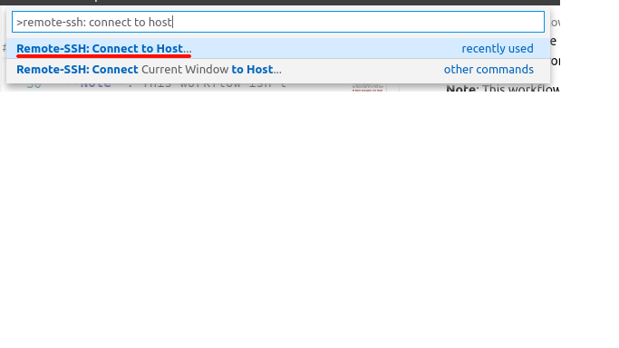
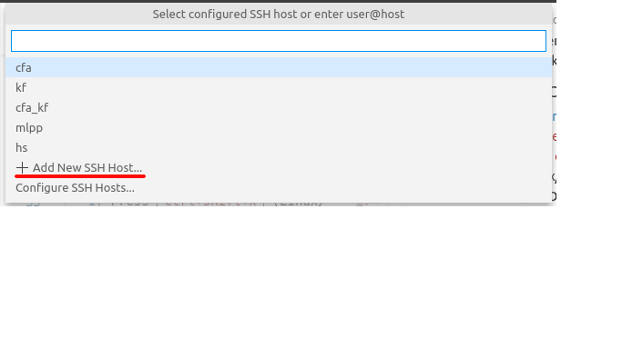
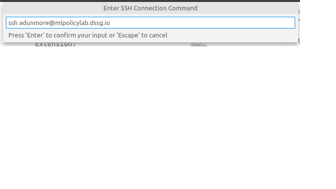
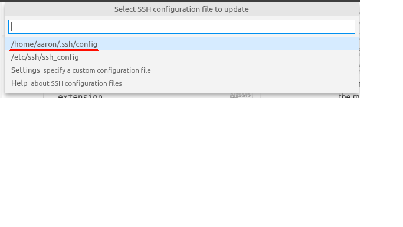
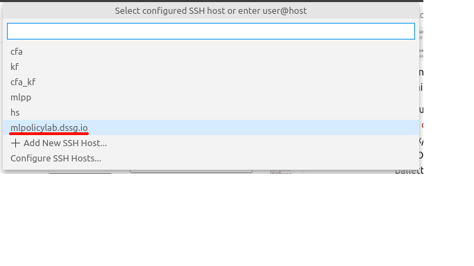
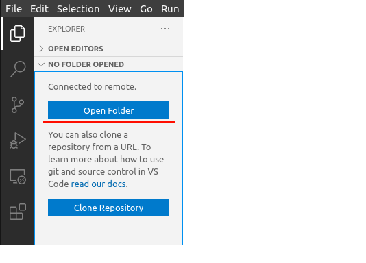
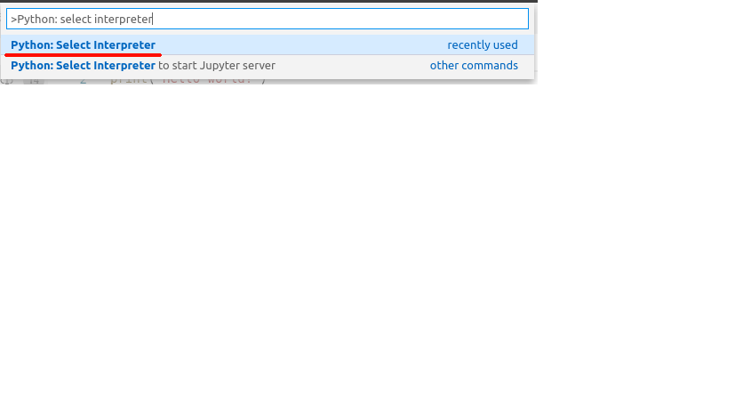
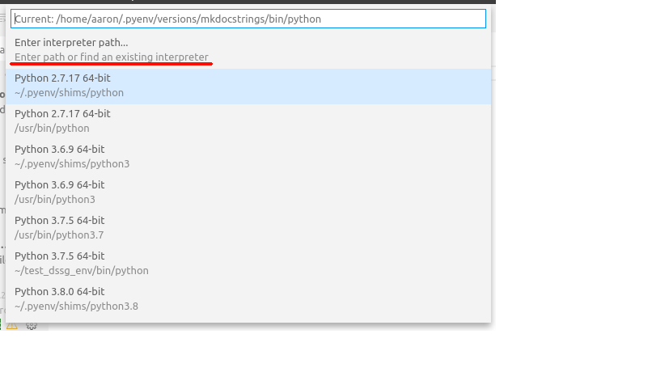
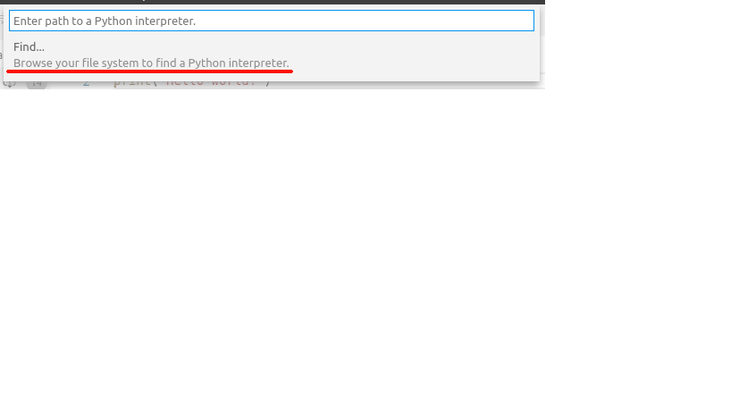

## Intro to: Remote Workflow

This document will provide you with tools for comfortably using our remote environment (the course server) to develop and test your team's pipeline.

**Agenda:**
1. Using VSCode for remote development
2. Using Jupyter remotely, with SSH tunneling
3. Navigating the course server using the command line
4. Remote development concepts - how exactly does all of this work?

## Remote development with VSCode

### What is VSCode over SSH?

For the first assignment, many people had trouble running their code on the course server. We heard a lot of questions, like "how do I run code saved on my laptop on the course server?"

This section will introduce one convenient workflow for developing code on the remote server. 

VSCode is an IDE that provides a lot of useful tools for developing Python, including autocomplete, syntax highlighting, support for virtual environments, and shortcuts to run python files.

With the VSCode SSH extension, VSCode can access code and other files stored on a remote computer. Furthermore, it can run any code stored on the remote machine.

This has several advantages:
- You don't have to keep any code stored on your local computer - you only need one copy, stored on the course server
- You don't have to copy code between your computer and the course server. Instead, VSCode lets you edit files where they're stored on the course server.
- VSCode makes it convenient to run code stored on the course server. When you're developing this way, you'll always have access to the database and your group's virtual environment.

**Note**: This workflow isn't required - it's just one "good enough" approach that we think many of you will find convenient. Please feel free to explore other workflows. 

### Configuring VSCode SSH
1. [Download and install](https://code.visualstudio.com/Download) VSCode
2. Install the `Remote - SSH` extension:
   1. Press `ctrl+shift+x` (Linux/Windows) or `⌘+shift+x` (MacOS) to open the extensions menu
   2. Search for and install `Remote - SSH`
    
   
   1. At this time, also search for and install the microsoft `Python` extension.
3. Configure our course server as an SSH host:
   1. Press `ctrl+shift+p` (Linux/Windows) or `⌘+shift+p` (MacOS) to open the command pallette, and select `Remote-SSH: Connect to Host`
   
   1. Select `Add New SSH Host...`
   

   1. Enter `ssh {andrewid}@mlpolicylab.dssg.io`
   
   1. Select the first option to store your login config: 
4. Connect VSCode to the course server:
   1. Connect to the CMU Full VPN
   2. Press `ctrl+shift+p` (Linux/Windows) or `⌘+shift+p` (MacOS) to open the command pallette, and select `Remote-SSH: Connect to Host`
   
   4. Select the ssh config we just created: `mlpolicylab.dssg.io`
   
5. Open a workspace folder:
   1. Select the folder menu button
   
   1. Selct `Open Folder`
   
   1. Select a folder to work in
   
6. Select your python virtual environment:
   1. Press `ctrl+shift+p` (Linux/Windows) or `⌘+shift+p` (MacOS) to open the command pallette, and select `Python: Select Interpreter`
   
   1. Select `Enter interpreter path`
   
   1. Select `Find...`
   
   1. Enter the path to the python executable in your virtual environment: `/path/to/your/environment/bin/python`. 
   
        If you're using your groups virtual environment, the path will be `/data/groups/{group_name}/dssg_env/bin/python`

        