## Intro to: Remote Workflow

This document will provide you with tools for comfortably using our remote environment (the course server) to develop and test your team's pipeline.

### Basic tools for common tasks

We're providing setup instructions and support for "good enough" tools for each of the common tasks in the workflow for this class but if you're comfortable with other tools, feel free to use them.

1. Writing code:
  - Python: This tutorial introduces ``VSCode``, an editor with good Python support, and some tools that make reomte development easy. 
  - However, feel free to use any editor you want (vim, emacs, sublime, pycharm). 
  - SQL: In other tutorials, we've introduced psql (for writing sql on the server) and DBeaver (on your laptop).
2. Jupyter notebooks:
  - In this tutorial, we will show how to set up ``Jupyter`` through a browser on your local machine.
  - Many Python IDEs (such as VSCode, Pycharm) have good Jupyter support - feel free to use one of these!
3. Share code with your team:
  - Use the git command line interface to push to your team github repository.
  - Many IDEs (including VSCode) have git integration.
4. Run code:
  - Run Python code manually in an SSH terminal, either by pasting code into a Python REPL, or running a Python script.
  - Some IDEs (such as VSCode) support remote interpreters, allowing you to run scripts in a python instance on a remote machine (here, the course server).


**Agenda:**
1. Using VSCode for remote development
2. Using Jupyter remotely, with SSH tunneling
3. Navigating the course server using the command line
4. Remote development concepts - how exactly does all of this work?

## Remote development with VSCode

### Why VSCode over SSH?

For the first assignment, many people had trouble running their code on the course server. We heard a lot of questions, like "how do I run code saved on my laptop on the course server?"

This section will introduce one convenient workflow for developing code on the remote server. 

VSCode is an IDE that provides a lot of useful tools for developing Python, including autocomplete, syntax highlighting, support for virtual environments, and shortcuts to run python files.

With the VSCode SSH extension, VSCode can access code and other files stored on a remote computer. Furthermore, it can run any code stored on the remote machine.

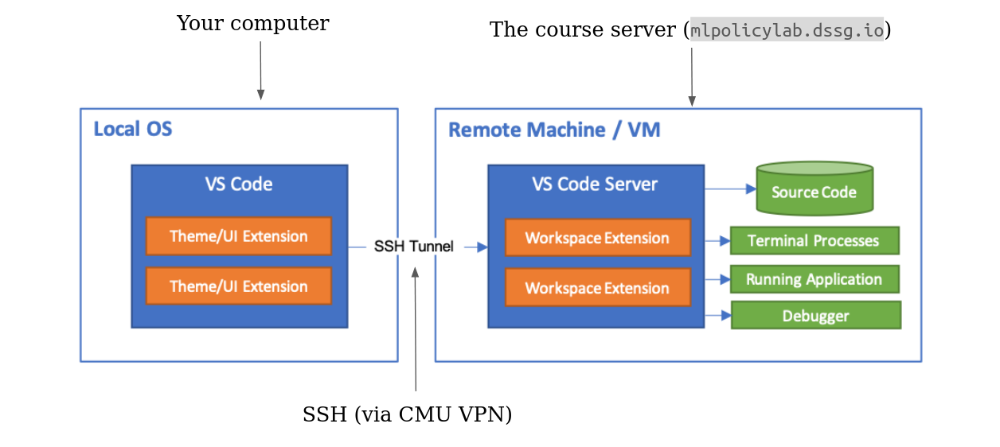

This has several advantages:
- You don't have to keep any code stored on your local computer - you only need one copy, stored on the course server
- You don't have to copy code between your computer and the course server. Instead, VSCode lets you edit files where they're stored on the course server.
- VSCode makes it convenient to run code stored on the course server. When you're developing this way, you'll always have access to the database and your group's virtual environment.

**Note**: This workflow isn't required - it's just one "good enough" approach that we think many of you will find convenient. Please feel free to use other workflows if you're already set up and comfortable with them. 

### Configuring VSCode SSH
1. [Download and install](https://code.visualstudio.com/Download) VSCode
2. Install the `Remote - SSH` extension:
   1. Press `ctrl+shift+x` (Linux/Windows) or `⌘+shift+x` (MacOS) to open the extensions menu
   2. Search for and install `Remote - SSH`
    
   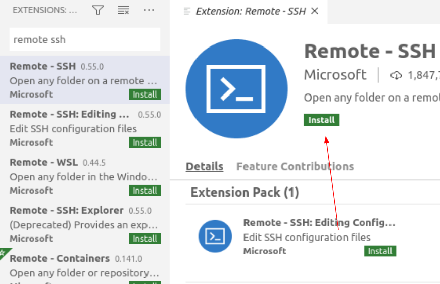

   1. At this time, also search for and install the microsoft `Python` extension.
3. Configure our course server as an SSH host:

    With the SSH plugin installed, we can tell VSCode how to log into the server. In this step we'll be entering our connection string and saving it in a file, making it easy to connect in the future.

   1. Press `ctrl+shift+p` (Linux/Windows) or `⌘+shift+p` (MacOS) to open the command pallette, and select `Remote-SSH: Connect to Host`
   
   

   2. Select `Add New SSH Host...`
   
   

   3. Enter `ssh -i {path to your private key} {andrewid}@mlpolicylab.dssg.io` 
   
   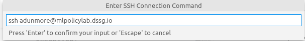

   4. Select the first option to store your login config: 
   
   

4. Connect VSCode to the course server:
   1. Connect to the CMU Full VPN
   2. Press `ctrl+shift+p` (Linux/Windows) or `⌘+shift+p` (MacOS) to open the command pallette, and select `Remote-SSH: Connect to Host`
   
   

   3. Select the ssh config we just created: `mlpolicylab.dssg.io`
   
   

   4. Enter your private key passcode if VSCode prompts you to (it will open a box at the top of the screen). 

   5. You should be connected to the course server. This should be indicated in the bottom of your VSCode window: 
   

5. Open a workspace folder:

    Now that VSCode is connected via SSH, you can browse all of the files and folders on the course server. In this step, we select a folder containing some code to edit and test.

   1. Select the folder menu button
   
   

   2. Select `Open Folder`
   
         

   3. Select a folder to work in
   
   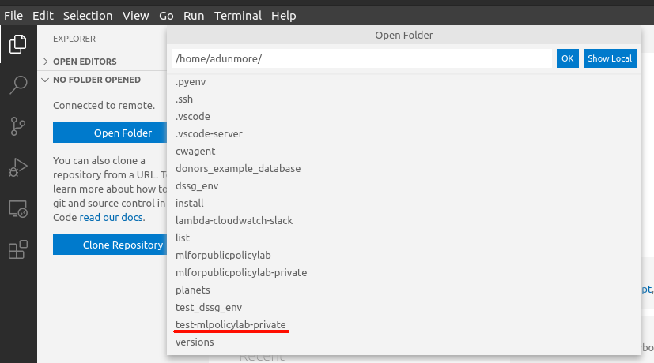

6. Select your python virtual environment:
   
   VSCode can be configured to automatically run python code in a virtual environment. Here, we'll select and activate our group virtual environments.

   1. Press `ctrl+shift+p` (Linux/Windows) or `⌘+shift+p` (MacOS) to open the command pallette, and select `Python: Select Interpreter`
   
   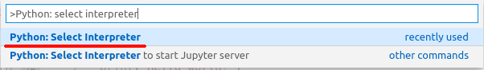

   2. Select `Enter interpreter path`
   
   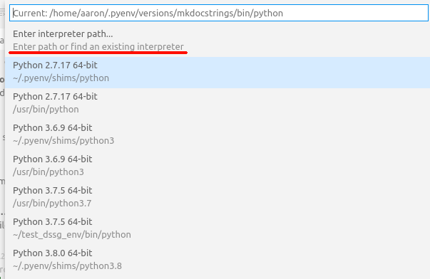

   3. Select `Find...`
   
   

   4. Enter the path to the python executable in your virtual environment: `/path/to/your/environment/bin/python`. 
   
        If you're using your groups virtual environment, the path will be `/data/groups/{group_name}/dssg_env/bin/python`

        

   5. After a moment, your selected python interpreter should be activated. This should be indicated in the bottom of your VSCode window:
   
   

7. Run python!
   1. Open the folder menu and select a python file (or press `ctrl+n` (Linux/Windows) or `⌘+n` (MacOS) to create a new one) 
   
   

   2. Click the green "play" button at the top of your window. This starts a new terminal session, activates your virtual environment, and runs your python code. 
   
   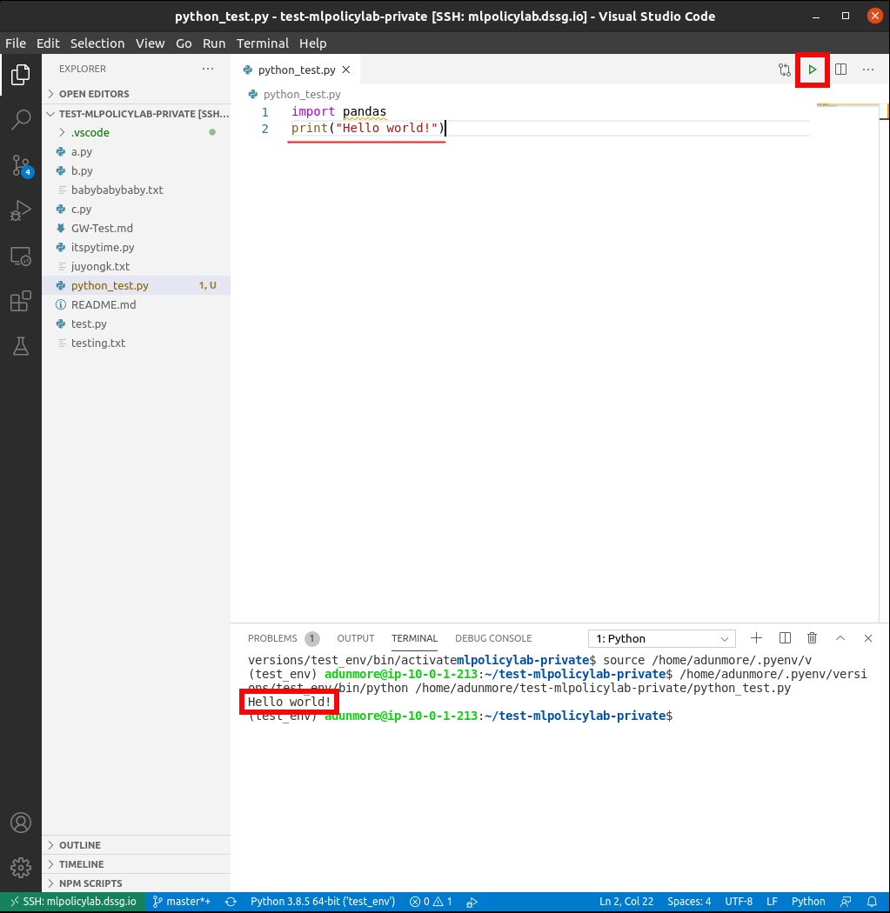

## Remote development with Jupyter

### How's it work?

Conceptually, this similar to how VSCode works over SSH:
- The remote machine (our course server) hosts a jupyter notebook server that does things like loads files, runs python, activates virtual environments
- Your web browser connects to that server and presents a frontend interface for opening, editing, and running notebooks
- These connect using SSH (inside the CMU VPN)
  
### Setting it up
1. Connect to the CMU VPN
2. Connect to the course server using SSH
3. Find an open port on the course server to send your Jupyter traffic through:
   1. In the terminal (on the course server) type `ss -lntu`. This will list all ports 
   2. Pick a port number between 1024 and 65535 that is NOT on that list.
   
   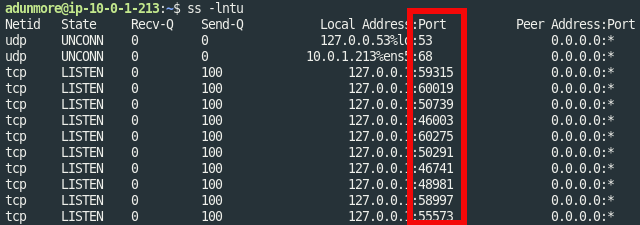
   (numbers in this box are ports currently in use)
   
4. On the course server, start your notebook server: 
   1. In the server terminal (inside SSH), run `jupyter notebook --no-browser --port {your port from step 3}`
   2. When the server starts, take note of the token printed in the server terminal output:
 
   
   (the token is printed multiple times)
5. On your local machine, set up an SSH tunnel. This will allow your web browser (on your local computer) to reach your Jupyter notebook server (on the course server):
   1. In a **local** terminal (not via ssh): type `ssh i- {path to your private key} -N -L localhost:8888:localhost:{your port from step 3} {andrew_id}@mlpolicylab.dssg.io`
   2. If you use putty, you'll need to follow a different set of steps. [Here's a tutorial for that](https://docs.bitnami.com/bch/faq/get-started/access-ssh-tunnel/). Enter `8888` in the `Source port` field. In `Destination`, enter `localhost:{your port from step 3}`
6. Open the notebook on your local machine:
   1. Open a web browser and navigate to http://localhost:8888. If that doesn't work, try:
      - http://0.0.0.0:8888/
      - http://127.0.0.1:8888/
   2. If this is your first time opening Jupyter, this should take you to a login page asking you to enter the token generated in step 4.2. Enter that token to proceed.
   3. In the next screen (which should be a view of the folders and files in your working directory):
      - To create a new notebook, click the `New` dropdown, and select your group's name. This will create a new notebook using your group's virtual environment.

      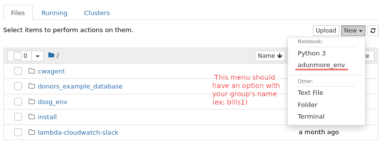
      - Double click an existing notebook to open it. Inside, navigate to `Kernel` -> `Change kernel` -> select your group's name. This will ensure the open notebook runs with your group's virtual environment

      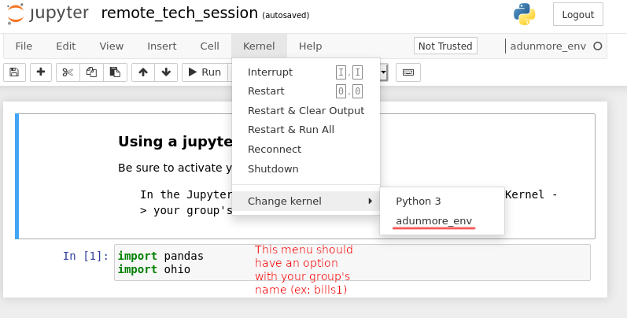

## Living in the command line

### Some key Linux concepts

#### Linux Paths

**Absolute paths**:

An absolute path is a path that starts at a system's root directory.


For example, the command `pwd` will print the absolute path to your current directory:

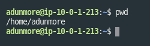

To refer to a location using an absolute path, specify your path starting with a `/`

Absolute paths are as unambiguous as possible. However, they're not as convenient as...

**Relative paths**

A relative path specifies the path to some folder or file, *relative to* the current location.

To use a relative path, specify a path *not* starting with a `/`

An example:
- I start in `/home/adunmore/mlforpublicpolicylab`
- I use `cd project` (note: doesn't start with `/`)
- I've changed directories to `/home/adunmore/mlforpublicpolicylab/project`


**The home directory**

In Linux, each user has a "home directory". This is the default directory a user enters upon login.

You can access your home directory with the command `cd ~`. 

You can also specify absolute paths in a similar way:
- My home directory is `/home/adunmore`
- I can access the folder `mlforpublicpolicylab` stored in my home directory with `cd ~/mlforpublicpolicylab`

#### Anatomy of a Linux command

Linux commands share a basic syntax. Let's take a look at one to see how it works:

```
ls -l --human-readable ./mlforpublicpolicy
```

This command contains four parts:

`ls`: This is the name of the command we're running. `ls` is a utility that lists the files and folders present in a directory. The command name is always the part that comes first.

`-l` & `--human-readable`: Both of these are options. Options are used to change the behavior of a command. Options usually start with one or two dashes (one dash for single-character options, two for longer options). 

`-l` tells ls to give detailed descriptions of all the files it lists (including size and permissions). `--human-readable` is self-explanatory: it tells `ls` to make its output easy to read.

`./mlforpublicpolicylab`: This is the argument. Here, it's a relative path to the folder that we're telling `ls` to list the contents of. Most Linux commands take an argument - often text, or a file or folder to operate on.

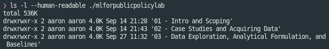

#### Getting help

Linux makes it easy to get help with a command:

```
man {command}
```

Opens the manual page for the command in question. Many commands also offer a help menu accessible with `{comand} --help`

### Some key command line tools

At first, it can be tough to do basic things like browsing folders or editing text in the command line. But Linux includes a lot of helpful tools for these kinds of tasks. In this section, we'll show how to use some of these tools to get around the terminal.

Follow along by executing the commands on the numbered lines.

1. Connect to the course server with SSH (if you aren't already)


**Getting oriented:**

Let's start by getting our bearings inside of the filesystem.

First, let's figure out where we are, with `pwd`:

`pwd` prints the **absolute path** of the current working directory.

2. Print your current working directory: `pwd`

Next, let's find out what's in our current directory, with `ls`:

```bash
ls {some_folder (by default, the working directory)}
``` 
lists the files in a directory.

3. List the files in your home directory: `ls`

**Making files**

Let's start doing some work. Start by using `mkdir` to make a new directory:

```bash
mkdir {folder_name}
``` 
Creates a new folder

4. Make a new directory: `mkdir my_test_dir`

Now, let's change into our new directory to do some work, with `cd`:

```bash
cd {some path}
```
Changes the working directory

5. Move to your new directory: `cd my_test_dir`

Make a new empty file with `touch`:

```bash
touch {file_name}
``` 
Create a new file

6. Make a new (empty) file: `touch a_test_file`

**Editing text in the command line**

Nano is a barebones text editor available on most Linux computers. While it's not as nice to use as something like VSCode, it's still quite convenient for making quick edits from the command line.

Start Nano like any other command line tool:

```bash
nano filename
```

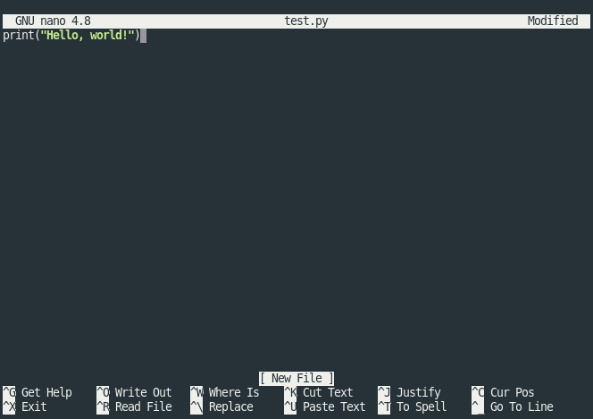

You should see something like this. The options along the bottom are keyboard shortcuts for controlling Nano. Here, `^` means `ctrl`. For example `ctrl+x` exits Nano, and `ctrl+w` searches the open file.

The top part of the screen is the editor. You can move your flashing cursor with your arrow keys. 

If you make changes and exit, Nano will display the following message, asking if you'd like to save. Press `y` to save, `n` to exit without saving, or `ctrl+c` to cancel and continue editing. 

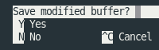


**Let's try it out:**

7. Open the file you created in step 6 with `nano`, and put some text in it:
   1. `nano a_test_file`
   2. Type something you learned in this tech session
   3. press `ctrl+c`, then `y` to save and exit

Let's use `cat` to make sure our changes worked:

```bash
cat {filename}
```

Prints the contents of a file (works best with text-based files)

8. Print the contents: `cat a_test_file`

**Moving files**

Let's learn some tools for manipulating existing files.

Let's start by copying our text file, with `cp`:

```bash
cp {source} {destination}
```
Copies the file at source to destination.

9.  Make a copy of your file, named "another_one": `cp a_test_file another_one`

Now, let's move that new file, with `mv`:

```bash
mv {source} {destination}
```
Moves the file or folder at source to destination.

10. Move the copy to your home directory: `mv another_one ~/`

Finally, let's delete that file with `rm` (turns out we didn't need it after all)

```bash
rm {file}
```
Remove (delete!) a file

11. Remove the copy file: `rm ~/another_one`

### Background tasks with screen

In this class, you'll often want to run long-running jobs in the terminal. However, by default, any tasks left running when you log out of ssh will be closed.

We can get around this with a Linux utility called `screen`. Screen is a "terminal multiplexer". That is, it allows you to keep run multiple terminal sessions, and keep them active even after you've logged off. 

Screen allows us to start a process (like a long-running python script), put it in the background, and log off without cancelling the script

**Running `screen`**

1. Log into the course server with ssh
2. Open a new screen session:

```
$ screen
```

You should see a screen with information about `screen` (licensing, a plea for free beer, etc). Press enter to bypass this. This will open a fresh terminal session, with your terminal history should be cleared out.

3. Verify that you're in a screen session by listing the open sessions owned by your account:

```
$ screen -ls
>There is a screen on:
>        18855.pts-44.ip-10-0-1-213      (09/30/20 18:32:05)     (Attached)
>1 Socket in /run/screen/S-adunmore.
```

One session is listed. It's labeled as `(Attached)`, which means you're logged into it.

4. Let's give our system some work to do. Run the following command, which will start a useless but friendly infinite loop:

```
$ while :; do echo "howdy do!"; sleep 1; done
```

Note that at this point, you could safely log off of `ssh`. Your loop would still be here when you logged back on.

5. Now that your screen session is busy, let's go back to our default session to get some work done.

pres `ctrl+a`, release those keys, and press `d`.

You should return to your original terminal prompt.

6. Check that your screen session is still there: run `screen -ls` to list open sessions again. This time, the single open session should be labeled as `(Detached)`, which means that you're not viewing it.

Note the 5-digit number printed at the beginning of the line referring to your screen session. We'll use that number to log back into that session.

7. Let's return to our session and kill that loop - we don't need it anymore.

We'll use `screen -r`. This reattaches the named screen. Use the 5-digit number from step 6 to refer to that session: 

```
screen -r {screen session number}
```

You should now be back in your old terminal session, where that loop has been "howdy"-ing away.

Press `ctrl-c` to close that loop.

8. Now we can close this screen session. Simply type `exit` in the command line.

This should kill our session and return us to the command prompt. If you'd like, confirm that your session is closed with `screen -ls`.

**Some notes:**

- You can name your session, with the `-S` flag:

```
$ screen -S some_name
```

Once you've assigned a name, you can use it to reattach your screen sessions, which is easier than remembering/looking up a number.

- You can use `screen` (and any of the utilities introduced here) in your VSCode terminal. Just press `ctrl+c` to exit your python session (if you're in one), and you'll be able to enter these commands just like a regular terminal session.

## Understanding the 10718 remote workflow

### Your machine is a client

You can think of your machine "client" in our system. This is because it doesn't do much of the computational heavy lifting. Rather, it views data stored on the database, uses utilities running on the server, and edits and runs code in the server's environment.

### SSH tunnelling

Since our projects involve sensitive, personal data, we keep the course server and database inside of a secure network hosted by Amazon Web Services. The course database and server are the only computers on the network. They cannot talk to computers outside of the network, with two exceptions:
- The course server can access the web (ie to download files from a website or query the census.gov api)
- The course server accepts SSH connections through the CMU VPN   

External computers cannot connect directly to the course server.

We can use SSH to get inside this network. We use SSH in two main ways:
- We use SSH to access the course server terminal. We can use this to access files stored on the server, and run programs like `python`, `psql`, `nano`, etc.
- We use SSH to open tunnels through the course server, to the course database. An SSH tunnel allows a client computer (ex: your laptop) to connect securely to any application accessible from a remote server (ex: our course server). For example:
  - We run Jupyter notebook servers on the course server. We can use an SSH tunnel to open hosted notebooks on our local computers
  - The course server can connect to the course database. We can use an SSH tunnel to allow local applications like DBeaver to connect to the course server, via the course server.

Interested in a deeper dive? Here's an article on [SSH tunneling](https://www.ssh.com/ssh/tunneling/).


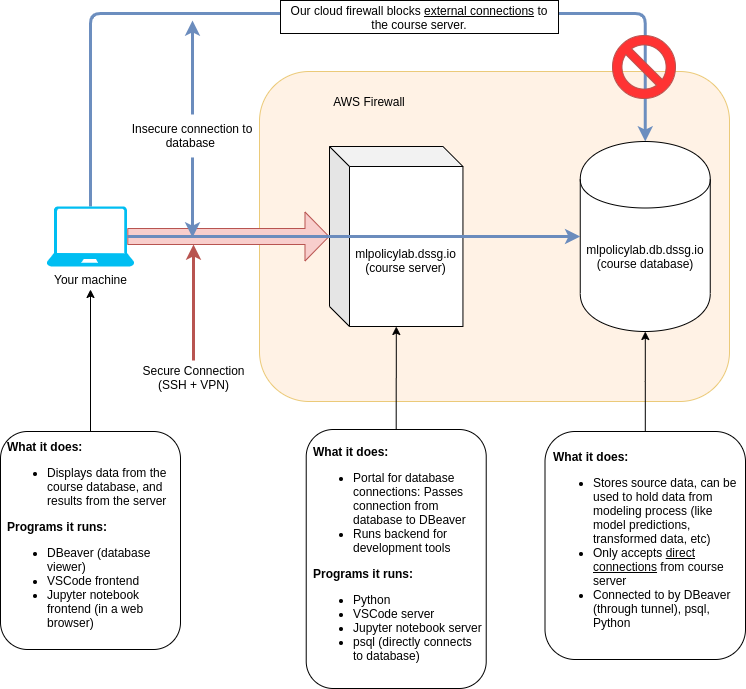

   **A diagram illustrating the class architecture.**
